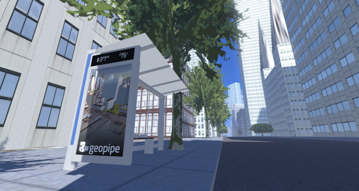

# Geopipe OG
Mod for Overgrowth that loads Geopipe environments via Blender.  

  
Geopipe Rockerfeller Plaza rendered inside Overgrowth.

## Install and run:

- Extract the geopipe_og folder to the Mods folder in the cache.
    - OSX : ~/Library/Application Support/Overgrowth/Data/Mods/
    - Windows : My Documents\Wolfire\Overgrowth\Data\Mods\
    - Linux : ~/.local/share/Overgrowth/Data/Mods/
- Launch Overgrowth.
- Click on Mods.
- Enable the Geopipe Mod.
- Go back to the main menu.
- Click Play.
- Click Custom Levels.
- Click Rockerfeller Plaza.

[Buy the game here.](http://www.wolfire.com/overgrowth)
